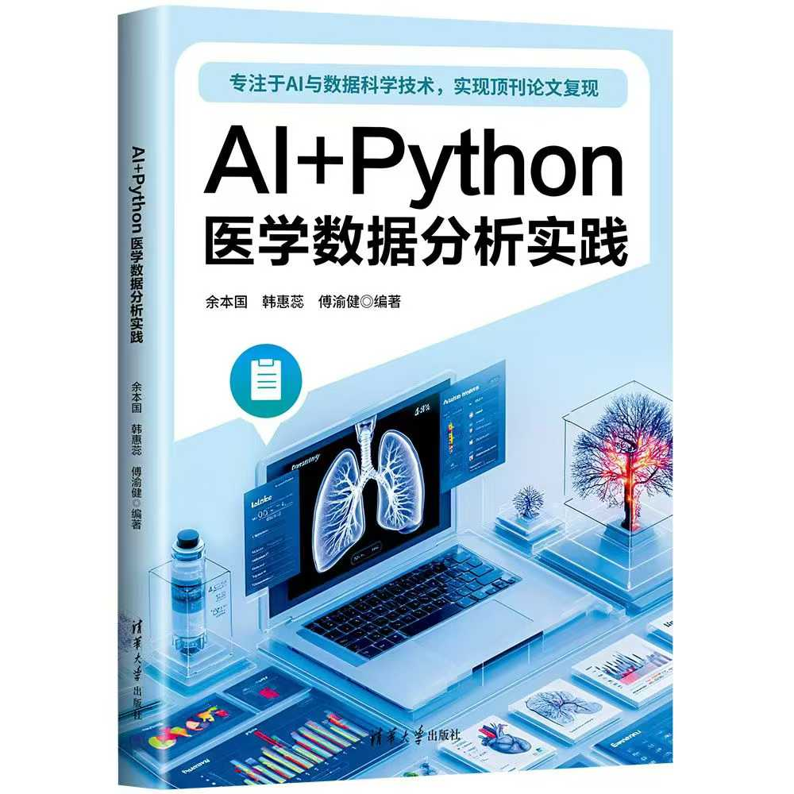

# -AI-Python-
书籍《AI+Python医学数据分析实践》代码仓库
本书是一本为零编程基础的数据分析人员编写的科研用书，包括拟从事
数据分析人员、医学生和医务工作者，是一本全面的医用数据分析与机器学
习指南。内容覆盖了Python 语法基础、数据的处理技巧、数据分析与挖掘、
数据可视化等，并选用了医疗分析综合案例，帮助大家熟悉数据分析处理的
过程。此外，本书还结合前沿大模型技术，详细介绍了如何利用AI大模型零
代码辅助数据分析的方法。 

也欢迎关注公众号：Python机器学习AI 进行更多机器学习知识学习
